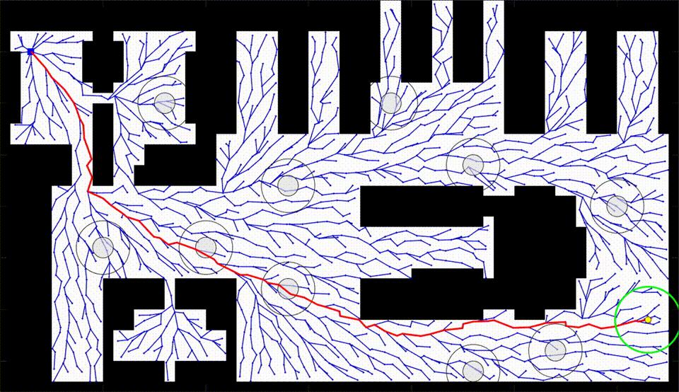

<h1 align="center">SMART: Self-Morphing Adaptive Replanning Tree</h1>
<h4 align="center">Zongyuan Shen, James P. Wilson, Shalabh Gupta*, Ryan Harvey</h4>
<h4 align="center">Department of Electrical & Computer Engineering, University of Connecticut, Storrs, CT, USA</h4>

<p align="center"> [<b><a href="https://arxiv.org/abs/2305.06487">Paper</a></b>] &emsp;  [<b><a href="https://www.youtube.com/watch?v=Xb0yWwwN0SE&list=PL4xQ0coJXyn97zfJDkQchZNPpYGJfCBJ6">Video</a></b>] &emsp; [<b><a href="#citation">Citation</a></b>]</p>

## Table of Contents

- [Introduction](#Introduction)
- [Usage](#usage)
- [Citation](#Citation)
- [Acknowledgement](#Acknowledgement)
- [License](#license)
- [Maintaince](#Maintaince)

## Introduction 
**SMART** facilitates fast reactive replanning in dynamic environments. It performs risk-based tree-pruning if the current path is obstructed by nearby moving obstacle(s), resulting in multiple disjoint subtrees. Then, it exploits these subtrees and performs informed tree-repair at hot-spots that lie at the intersection of subtrees to find a new path.

<p align="center">
  
  
</p>

<p align="center">
Fig. Robot and dynamic obstacles are moving at a constant speed of 4m/s. Video play speed is 1x.
</p>

## Usage

### C++
- **User-defined inputs:**
  - File "Main.cpp": trialIndex, dynObsNum, dynObsSpeed, robotSpeed, sceneIndex, dynObsPosition 
  - File "SMART.cpp": goalX, goalY, cellSize, robotX, robotY
  - File "SMART.h": mapROW, mapCOL
```
trialIndex: control the random seed to generate the tree
sceneIndex: control the random seed to generate dynamic obstacle motion
dynObsPosition: initial position of dynamic obstacle
goalX and goalY: fixed goal position
robotX and robotY: varying robot position with user-defined initial value
cellSize: size of cell in meter
mapROW: number of cells in each row
mapCOL: number of cells in each column
```

- **Outputs:**
  - Replanning time (s)
  - Trajectory length (m)
  - Travel Time (s)
  - Recorded data
    
- **Recorded data:**
  - Dynamic obstacle
  - Tree
  - Path
  - Robot's footprint
```
Function dataRecord() is used to record the data for visualization on Matlab.
```

- **Compilation:**
```
compile Main.cpp
run the executable file
```

### Matlab for visualization:
- **User-defined input:**
  - File "Main.m": folder. It is a character array to store the directory to the folder that contains the recorded data.
  - File "Main.m": videoRecord. A demo video will be created if videoRecord = true.

- **Demo generation:**
```
run Main.m
```
    

## Citation

If you use the results presented in this paper or the code from the repository, please cite the relevant [paper](https://arxiv.org/abs/2305.06487):
```
@article{shen2023smart,
author={Shen, Zongyuan and Wilson, James P and Gupta, Shalabh and Harvey, Ryan},
journal={IEEE Robotics and Automation Letters},
title={SMART: Self-Morphing Adaptive Replanning Tree},
year={2023}
volume={},
number={},
pages={-},
doi={}
}
```

## Acknowledgement
This research is supported by the Air Force Research Laboratory.

## License

[MIT](LICENSE) © Zongyuan Shen

## Maintaince
For any technical issues, please contact Zongyuan Shen (zongyuan.shen@uconn.edu).
